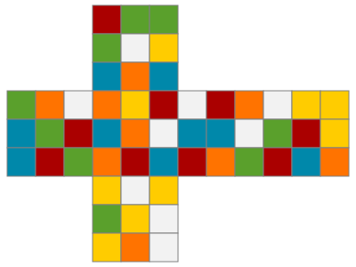

# Rubik's Cube solver in Haskell
### Example cube visualisation outputed as SVG file by the program:


## Running the project
To solve the cube defined in [example-cube.txt](examples/example-cube.txt) file:
```bash
runhaskell solver.hs examples/example-cube.txt
```
The program will print all rotations made to solve the cube to standard output and will save SVG visualisations for every solving phase in `results/phase$i.svg`. Input cube visualisation will be saved as `results/input.svg`.

## Cube data structure
// TODO

## Input file structure
The cube is read from text file as lists of edges and corners colors separated by single empty line. The order of edges/corners is predefined in module `CubeReader` in functions `edgesReadingOrder` and `cornersReadingOrder`. See example input files for a [randomly scrambled](examples/example-cube.txt) cube and [already solved cube](examples/solved-cube.txt).  
Color symbols are: `W` (white - top face), `Y` (yellow - bottom face), `G` (green - left face), `O` (orange - front face), `B` (blue - right face), `R` (red - back face).
